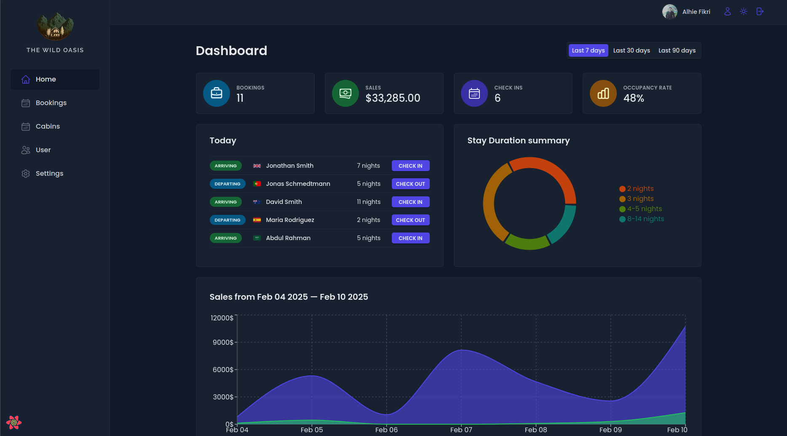
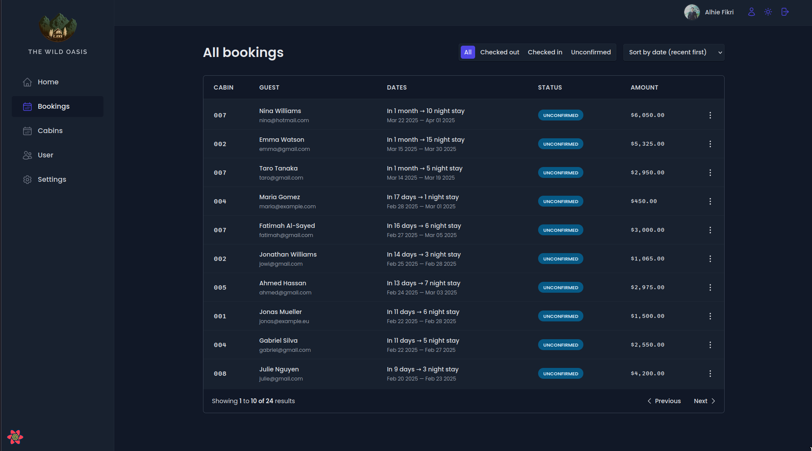
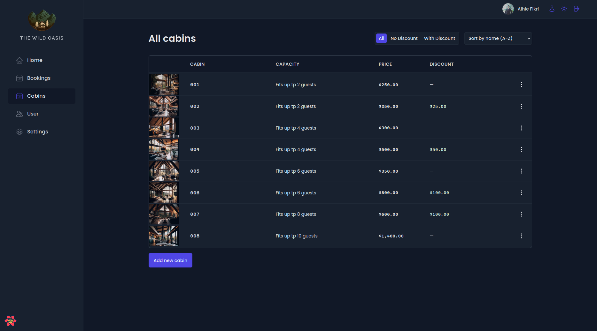
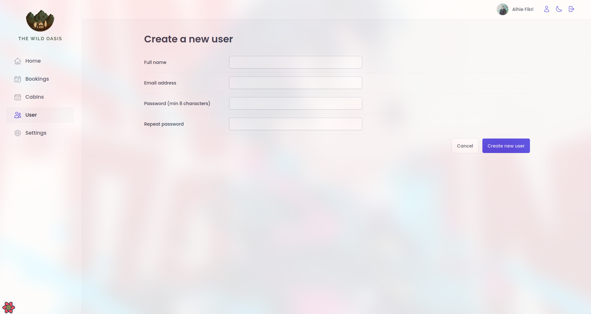
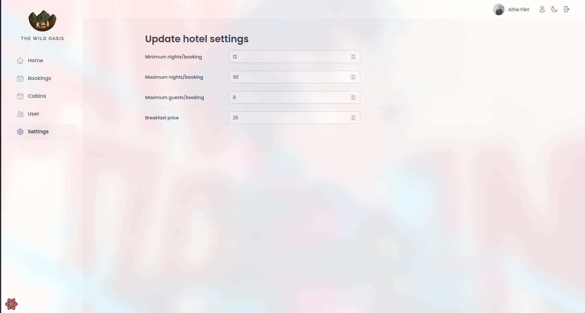
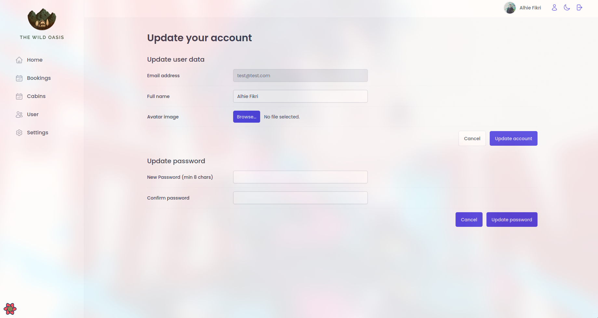

# The Wild Oasis

The Wild Oasis is a modern web application designed for booking cabins and more. It provides an intuitive dashboard, secure authentication, and a seamless booking experience for users. The application is built using **React**, **React Router**, **React Query**, and supports **dark mode** for a better user experience.

## Features

- **Cabin Booking System**: Users can browse and book cabins effortlessly.
- **User Management**: Admins can manage user accounts.
- **Check-in & Check-out**: Simplified check-in process for booked cabins.
- **Dashboard Overview**: Key metrics and insights into bookings and revenue.
- **Dark Mode Support**: Toggle between light and dark themes.
- **Authentication & Protected Routes**: Secure login and access control.

## Tech Stack

- **React**: Frontend framework.
- **React Router**: Client-side routing.
- **React Query**: API data fetching and state management.
- **React Hot Toast**: Notifications and alerts.
- **Styled Components**: Custom global styles.

## Installation

1. Clone the repository:
   ```bash
   git clone https://github.com/alhiefikri/the-wild-oasis.git
   cd the-wild-oasis
   ```
2. Install dependencies:
   ```bash
   npm install
   ```
3. Start the development server:
   ```bash
   npm start
   ```

## Project Structure

```
/src
 ├──assets
 ├──context
 │  ├── DarkModeContext.jsx
 ├──data
 ├──features
 │  ├── authentication
 │  ├── booking
 │  ├── cabins
 │  ├── check-in-out
 │  ├── dashboard
 │  ├── settings
 ├──hooks
 │  ├── useLocalStorageState.js
 │  ├── useMoveBack.js
 │  ├── useOutsideClick.js
 ├── pages
 │   ├── Dashboard.js
 │   ├── Cabins.js
 │   ├── Bookings.js
 │   ├── Users.js
 │   ├── Settings.js
 │   ├── Login.js
 │   ├── Account.js
 │   ├── PageNotFound.js
 ├── services
 ├── styles
 ├── ui
 │   ├── AppLayout.js
 │   ├── ProtectedRoute.js
 ├── context
 │   ├── DarkModeContext.js
 ├── styles
 │   ├── GlobalStyles.js
 ├── services
 │   ├── apiBookings.js
 ├── utils
 │   ├── helpers.js
 ├── App.js
```

## Screenshots

## Pages

### 🏠 Home

<p align="center">
  
</p>

The main dashboard displaying key statistics and insights.

### 📖 Bookings

<p align="center">
  
</p>

Manage all bookings, view details, and check guest reservations.

### 🏕️ Cabins

<p align="center">
  
</p>

Manage available cabins, add new ones, and edit existing listings.

### 👥 Users

<p align="center">
  
</p>

View and manage user accounts, including new registrations.

### ⚙️ Settings

<p align="center">
  
</p>

Customize system preferences and configurations.

### 🔄 Update Profile

<p align="center">
  
</p>

Edit account details, change passwords, and manage personal settings.

## Deployment

This application can be deployed on platforms like **Vercel**, **Netlify**

## License

This project is licensed under the MIT License.
